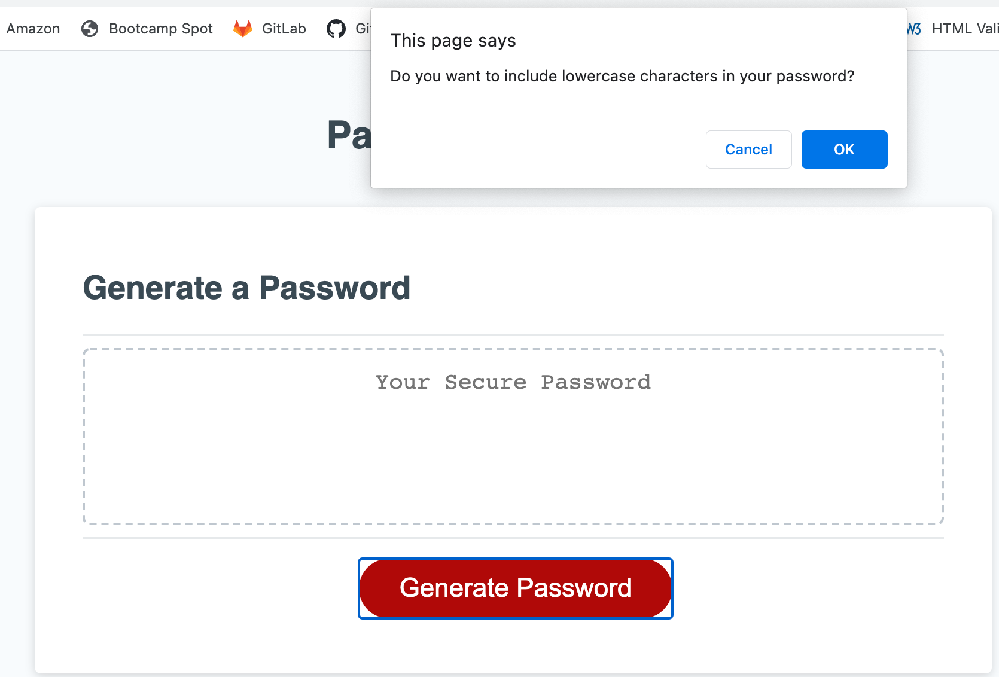
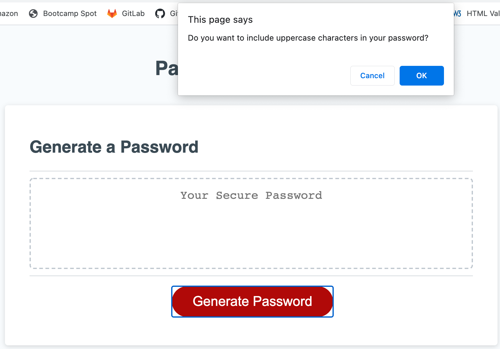
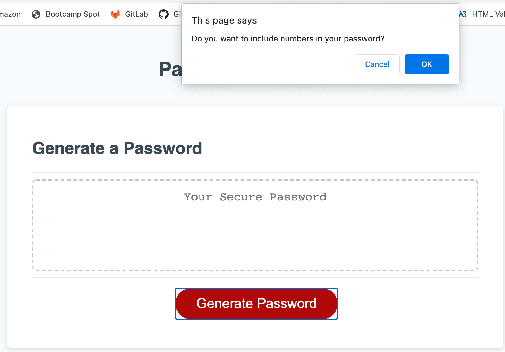
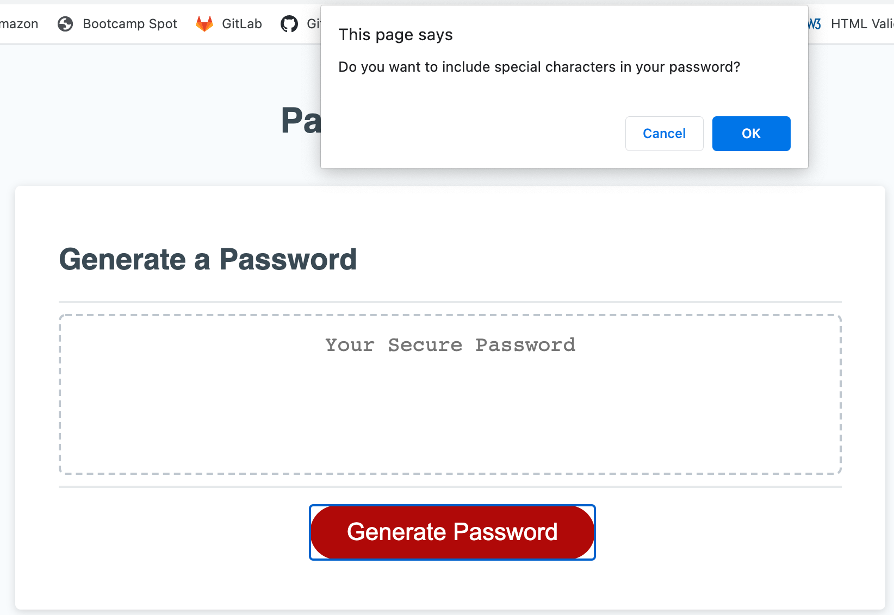
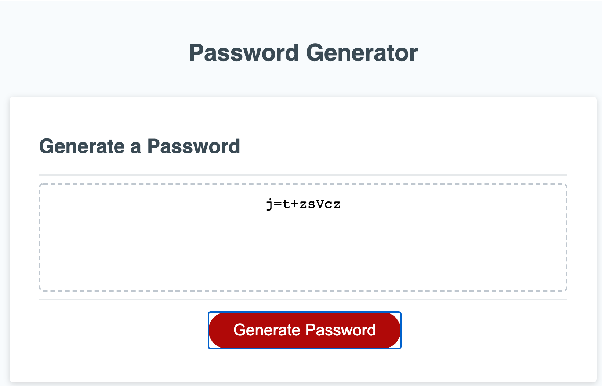

# Password-Generator

Link to deployed html: https://carlypeyton.github.io/Password-Generator/index.html

This was a trickier project for me, and I spent many days working on it, ultimately starting over from scratch a number of times. I ended up creating a new repository and re-making much more detailed commits, step by step, to clean up my repository and allow me to look back on for future reference. It was helpful for me to walk back through each piece and put the logic into words. 

I started by creating the 4 character types, and setting string values for each. I had previously tried using arrays but was having difficulty, so decided to use string values to utiize .charAt that we recently went over in class. I defined these variables, and then created empty strings for my future randomly generated password AND the password characters group that the former would be randomly composed of. 

Next I began on my write password function. I created a prompt for password length, alerting the user if they input an invalid value or one outside the acceptable length range. I created confirms for each character type. The user is alerted if they do not select at least one character type, and must try again.

I set my randomlyGeneratedPassword variable equal to the password ID within the HTML doc, so that it would be displayed in the generator box on the webpage. I then created my generate password function, using if statements to evaluate user responses to confirms, and if statement is true, a randomly selected letter from that string is added to the password characters group. For all acceptable password lengths, per user prompt, a character within the password characters string for each character type is added to the randomly generated password. The randomly generated password is then returned.

Finally, I went back through and cleaned up my code, running the script file through a javascript validator to check for any errors.

Overall, this homework assignment was challenging but I learned a lot. It will be a helpful reference for me going forward.

!alt text](Screen Shot 2020-12-13 at 11.00.51 PM.png)

